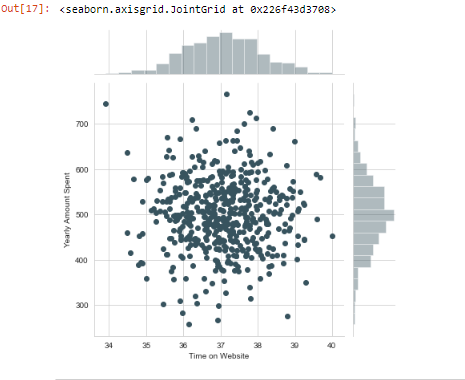
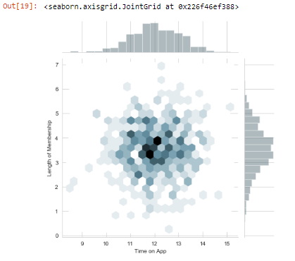
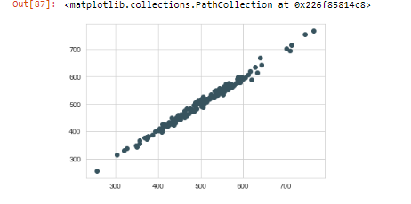

This is a basic <b>"Linear Regression Model"</b> created by using <b>"Scikit Learn"</b>

<h4>Problem statement :-</h4> 

"There is an Ecommerce company based in New York City that sells clothing online but they also have in-store style and clothing advice sessions.
Customers come in to the store, have sessions/meetings with a personal stylist, then they can go home and order either on a mobile app or website for the clothes they want.

The company is trying to decide whether to focus their efforts on their mobile app experience or their website. They've hired you on contract to help them figure it out! Let's get started!"

<h4>Approach taken to solve this problem :-</h4>

Here I have used 

1.Pandas for data modulation
2. Seaborn for data vizualization
3. Scikit  learn for spliting data into training and testing sets and do the predictions.

Here I have used some data visualiaztion methods to show you various data models

Like this

or this,

And after complition of the prediction I have used this plot to show you the outcome of the model,

NB:- This is a very basic model and the data used in this model was already cleaned so you couldn't find any data cleaning methods.

